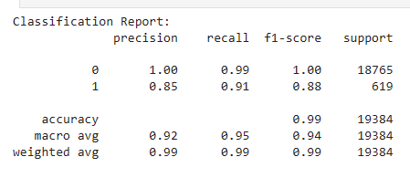
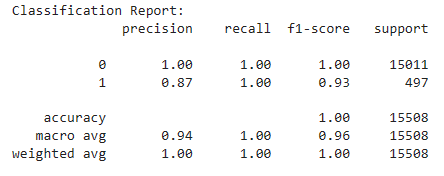

# credit-risk-classification
Module 20 Homework

#Instructions:
This Challenge are divided into the following subsections:

* Split the Data into Training and Testing Sets
* Create a Logistic Regression Model with the Original Data
* Write a Credit Risk Analysis Report
* Split the Data into Training and Testing Sets

## Open the starter code notebook and use it to complete the following steps:
 ### Read the lending_data.csv data from the Resources folder into a Pandas DataFrame.

  ### Create the labels set (y) from the “loan_status” column, and then create the features (X) DataFrame from the remaining columns.

* * NOTE
( A value of 0 in the “loan_status” column means that the loan is healthy. A value of 1 means that the loan has a high risk of defaulting.)

  ### Split the data into training and testing datasets by using train_test_split.

### Create a Logistic Regression Model with the Original Data, then later the resamlpled data
   Use your knowledge of logistic regression to complete the following steps:

  * Fit a logistic regression model by using the training data (X_train and y_train).
  * Save the predictions for the testing data labels by using the testing feature data (X_test) and the fitted model.

### Evaluate the model’s performance by doing the following:
  * Generate a confusion matrix.
  * Print the classification report.

## Credit Risk Analysis Report
Answer the following question: How well does the logistic regression model predict both the 0 (healthy loan) and 1 (high-risk loan) labels?

This section will be used to describe the analysis completed for the machine learning models used in this Challenge. 

* The purpose of this analysis is to see how well a logistic training model can accurately predict both healthy loans and high-risk loans.

* The data used to make these predictions were based on the follwowing variables:
  ** loan_size	
  ** interest_rate	
  ** borrower_income	
  ** debt_to_income	
  ** num_of_accounts	
  ** derogatory_marks	
  ** total_debt	
  ** loan_status

* The loan status column was used, as labels for the predictions: 0 (healthy loan) and 1 (high-risk loan). 
* A combination of the other columns as the features. Together helped make the predictions. 
* 

Provide basic information about the variables you were trying to predict Initially the dataset proved to be extremely imbalanced. Using the `value_counts` function provided the ability to see how imbalanced :
    ** 0    75036
    ** 1     2500

* The initial stages of the machine learning used in this included:
  Step 1: Read the lending_data.csv data from the Resources folder into a Pandas DataFrame.
  Step 2: Create the labels set (y) from the “loan_status” column, and then create the features (X) DataFrame from the remaining columns.
  Step 3: Check the balance of the labels variable (y) by using the value_counts function.
  Step 4: Split the data into training and testing datasets by using train_test_split.
  
  Once this was complete, I created a Logistic Regression Model with the Original Data, then later the ReSampled Data by doing the following: 
    * Fit a logistic regression model by using the training data (X_train and y_train)
    * Save the predictions for the testing data labels by using the testing feature data (X_test) and the fitted model.
    * Evaluate the model’s performance by generating a confusion matrix.
    * Print the classification report.

Some of the methods and dependencies used include: 
  * LogisticRegression module from SKLearn
  * RandomOverSampler module form imbalanced-learn
  * Calculating balanced accuracy from sklearn.metrics import balanced_accuracy_score
  * from sklearn.metrics import confusion_matrix, and classification_report

## Results

Using bulleted lists, describe the balanced accuracy scores and the precision and recall scores of all machine learning models.

* Machine Learning Model 1:
  * Balanced Accuracy: 0.9520479254722232
  

* Machine Learning Model 2:
  * Balanced Accuracy: 0.9955896862756715
 

## Summary

* Which one seems to perform best? How do you know it performs best?
The random oversampler seemed to work better. It had a higher accuracy acore, precision score and overall scores on the classification report.
* Does performance depend on the problem we are trying to solve? (For example, is it more important to predict the `1`'s, or predict the `0`'s? )

In my opinion, its is more important to accurately predict the risky loans and they are the ones that could bring the institution less money and more issues. 
